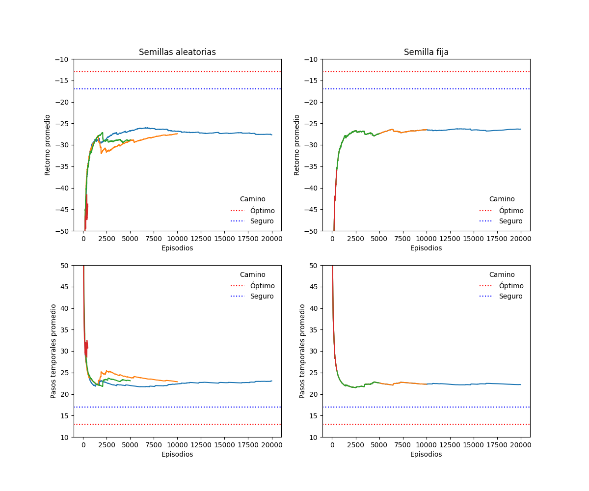
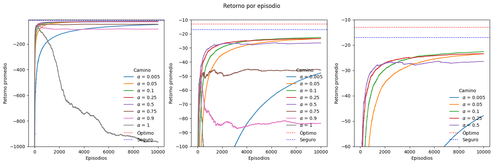

# Diplomatura en ciencia de datos, aprendizaje automático y sus aplicaciones - Edición 2023 - FAMAF (UNC)

## Aprendizaje por refuerzos

### Trabajo práctico entregable 1/2 (materia completa)

**Estudiante:**
- [Chevallier-Boutell, Ignacio José.](https://www.linkedin.com/in/nachocheva/)

**Docentes:**
- Palombarini, Jorge (Mercado Libre).
- Barsce, Juan Cruz (Mercado Libre).

---
# Ejercicio: SARSA + $\epsilon$-greedy

> Cantidad de episodios y semilla aleatoria (default)

En la siguiente figura se ve la variación del retorno y la cantidad de pasos temporales en función de la cantidad de episodios (entre 500 y 20000), dejando que la semilla sea aleatoria (izquierda) o fijándola (derecha). Se utilizaron los hiperparámetros *por defecto* (los que están en las consignas): $\alpha=0.5$, $\gamma=1$ y $\epsilon=0.1$.

Se observa que:
* El algoritmo utilizado es determinista.
* Ambos casos alcanzan un *plateau*, a unos 10 puntos de distancia respecto al valor de referencia Camino Seguro.
* No hay ningún early stopping, llegando en todos los casos al objetivo.
* Todas las corridas son sumamente rápidas (1 a 40 s).

Se decide:
* Fijar la semilla del generador de números aleatorios.
* Fijar la cantidad de episodios en 10000.

***Observación:*** a los fines de que sea reproducible, para el caso aleatorio se usó en cada caso el número de episodios correspondiente como semilla del generador de números aleatorios.

> Barrido de $\alpha$

En la siguiente figura se ve la variación del retorno y la cantidad de pasos temporales en función de la tasa de aprendizaje (entre 0.005 y 1), para 10000 episodios y con una semilla fija, teniendo $\gamma=1$ y $\epsilon=0.1$. No se utiliza $\alpha=0$ porque esto sería equivalente a no aprender, ya que en la función de actualización lo único que se haría es sumar 0 al valor de Q.

Se observa que:
* A menor $\alpha$, el aprendizjae es más lento, pero más seguro.
* Desde 0.75 en adelante se introduce una gran cantidad de ruido: el agente comienza aprendiendo , preo a los pocos episodios *comienza a desaprender*.
* Las curvas son prácticamente suaves para valores iguales o menores a 0.25.
* Salvo $\alpha=0.9$ y $\alpha=1$ que presentan 0.01% y 1.45% de early stopping, los demás llegan al objetivo.
* Las corridas son muy rápidas (15 s a 3 min s).

Entre $\alpha$ igual a 0.1 y 0.05 no hay tanta diferencia de velocidad y el gap a los 10000 episodios es pequeño. Se decide fijar $\alpha=0.05$.

> Barrido de $\gamma$

> Barrido de $\epsilon$

> Cantidad de episodios y semilla aleatoria (óptimos)

---
# Acá hay notas

Dado que el descuento $\gamma$ es iguala 1, en teoría deberíamos eventualmente alcanzar el retorno óptimo al aumentar la cantidad de episodios, siempre y cuando la tasa de aprendizaje $\alpha$ sea lo suficientemente pequeña.

El hiperparámetro $\alpha$ me determina la velocidad de convergencia. Cuando $\alpha=1$, la convergencia es muy brusca, pudiendo llegar a quedar oscilando. Al bajar el valor de $\alpha$, nos aseguramos de que eventualmente converja. Supongamos que el objetivo es juntar 50 puntos. Puede ocurrir que con $\alpha=1$ nos movamos muy rápido y terminemos oscilando en torno a un punto o puede que rápidamente llegemos a 50 puntos. Cuanto menor es el $\alpha$, más lenta será la evolución, pero eventualmente llegamos a 50 puntos.

Por otro lado, $\gamma$ nos limita el horizonte. Cuando  $\gamma=1$, dependemos exclusivamente del $\alpha$ para saber qué tan rápido o lento alcanzamos los 50 puntos. En cambio, si $0<\gamma<1$, no importa qué tan rápido o lento aprendamos, siempre habrá un techo para el valor al que convergemos, siendo menor a 50 puntos. Cuanto menor sea $\gamma$, más por debajo de 50 puntos nos vamos a encontrar.

# Sarsa greedy

2) Barrer alfa, gamma y epsilon, fijando la semilla, el max_iter y la cantidad de episodios. 

Barrido de gamma con eps = 10k y alpha = 0.05. Ver qué implica un gamma nulo. A menor gamma, necesita más iteraciones para alcanzar el Goal (necesitaría un mayor max_iter). Por eso la proporción de Earlies aumenta. Consume mucho más tiempo y no está cumpliendo encima. Ya con 0.25 tarda unos 14 minutos. Cortar en 0.1. Me quedo con gamma=0.65.

--hasta acá hice en mi compu--
-- todo lo que sigue lo hice con la compu del lab (cuidado con la comparación de wall time) --
-- Armar todo el código necesario, pero volver a correr en mi compu  esta parte de epsilon--

Epsilon sí puede valer 0 y 1 por explotar o explorar a full. Cuidado que en el sorteo de exploración se incluyen los máximos. Usar el rango que venímos viendo más estos dos extremos. Agregue valores entre 0 y 0.1. Me quedo con epsilon = 0.005

3) Con la combinación óptima, barrer episodios de nuevo?

Hice este barrido fijando la semilla.

--Hasta acá llegó lo de que hice en la compu del lab--

Con 200000 episodios, repetí con semilla libre.

> Mostrar la grilla q para los casos extremos: se inclina por el camino seguro más que por el óptimo. (esto lo saque antes del 1, pero aplicar en general).

# Q-learning greedy

1) Hacer lo mismo que en el de greedy. Comparar intra e inter. ¿Cómo converge con respecto a SARSA? ¿A qué se debe? Comentar.

> Hasta acá ya tendría las 3 primeras actividades hechas. Las dos que siguen son opcionales: la de SoftMax y la de Dyna-Q

Nunca hubo un drop.

