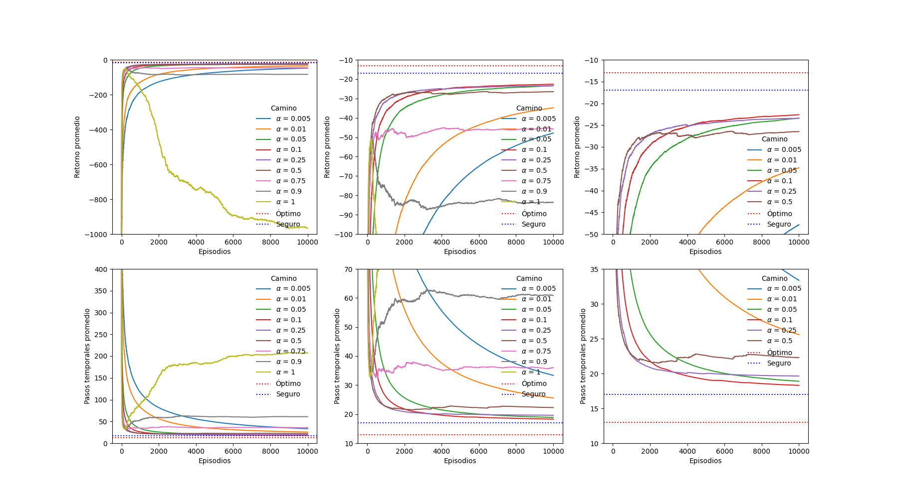
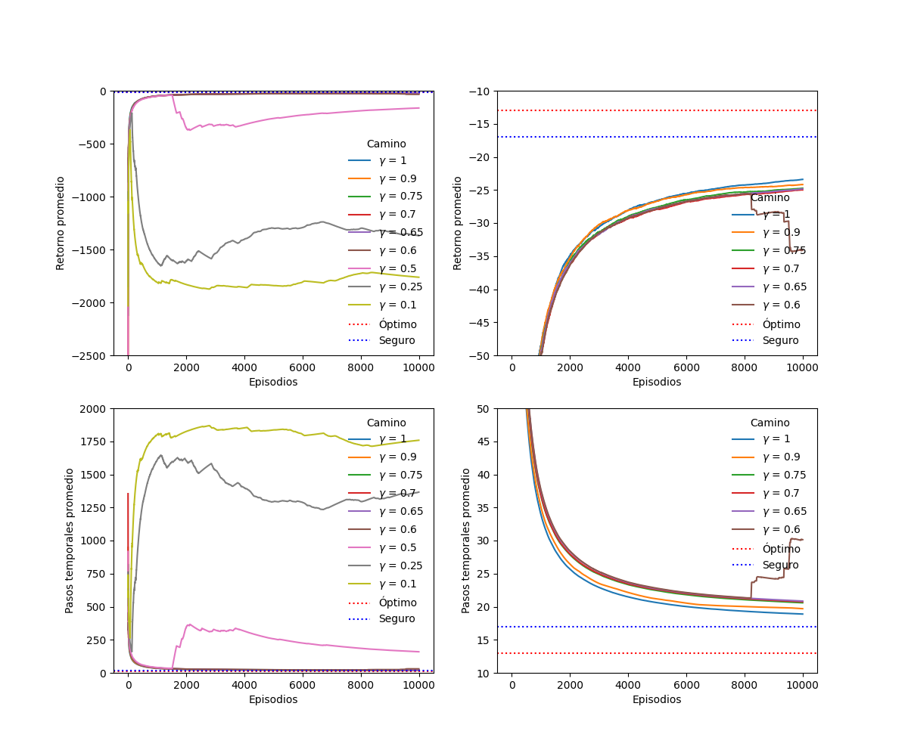
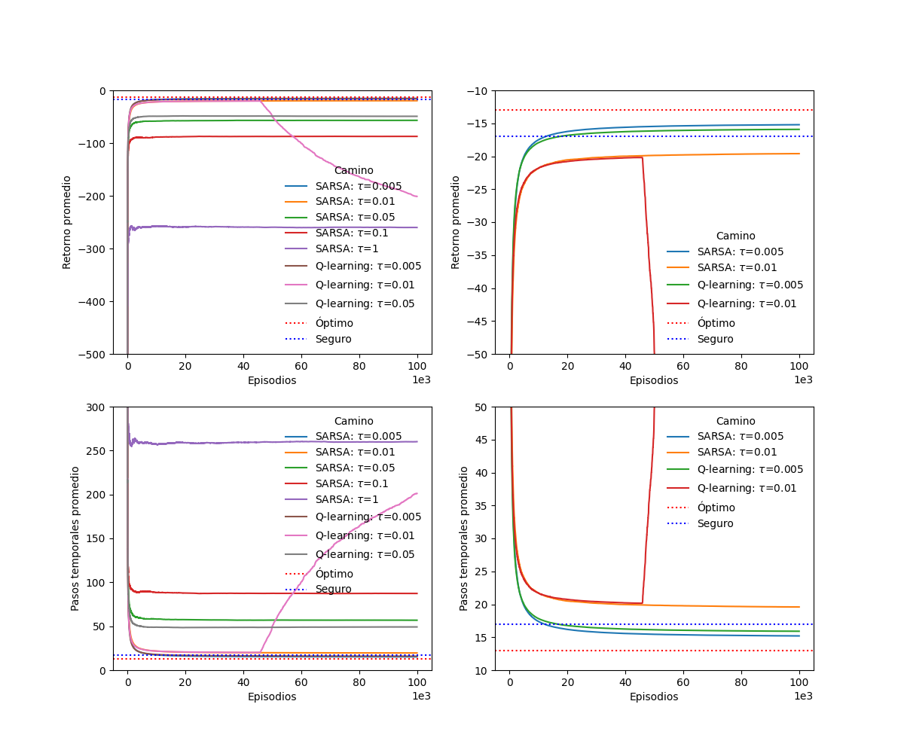
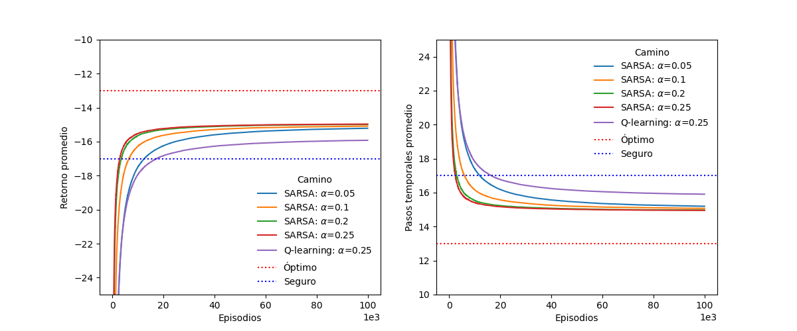
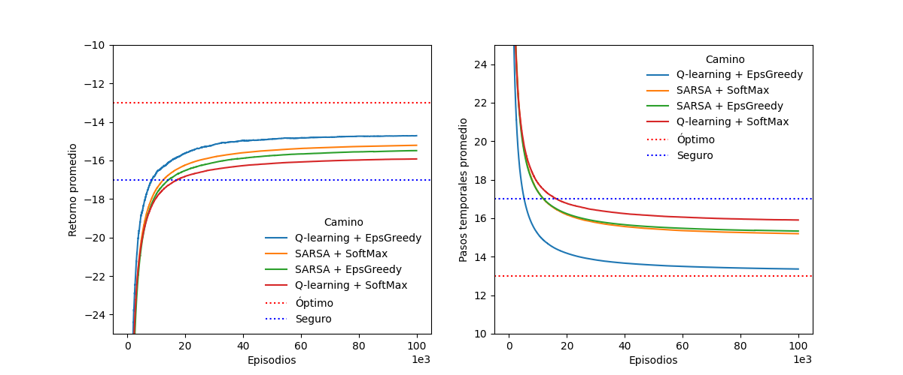

# Diplomatura en ciencia de datos, aprendizaje automático y sus aplicaciones - Edición 2023 - FAMAF (UNC)

## Aprendizaje por refuerzos

### Trabajo práctico entregable 1/2 (materia completa)

**Estudiante:**
- [Chevallier-Boutell, Ignacio José.](https://www.linkedin.com/in/nachocheva/)

**Docentes:**
- Palombarini, Jorge (Mercado Libre).
- Barsce, Juan Cruz (Mercado Libre).

---
# SARSA + $\epsilon$-greedy

Todos los plots que se utilizan en la presente entrega representan la variación del retorno y la cantidad de pasos temporales en función de cierto parámetro variable, dejando todos los demás fijos.

### Cantidad de episodios y semilla aleatoria (default)

Parámetros:
* **Variable:** cantidad de episodios ($Eps\in[500, 20000]$), dejando que la semilla sea aleatoria (izquierda) o fijándola (derecha).
* **Fijos:** $\alpha=0.5$, $\gamma=1$ y $\epsilon=0.1$. Se utilizaron los hiperparámetros *por defecto* (los que están en las consignas).

Se observa que:
* El algoritmo utilizado es determinista.
* Ambos casos alcanzan un *plateau*, a unos 10 puntos de distancia respecto al valor del Camino Seguro.
* No hay ningún early stopping, llegando en todos los casos al objetivo.
* Todas las corridas son sumamente rápidas (1 a 40 s).

Se decide:
* Fijar la semilla del generador de números aleatorios.
* Fijar la cantidad de episodios en 10000.

***Observación:*** a los fines de que sea reproducible, para el caso aleatorio se usó en realidad el número de episodios correspondiente como semilla del generador de números aleatorios. Esta decisión se aplica siempre que se quiera variar la semilla.

### Barrido de $\alpha$

Parámetros:
* **Variable:** tasa de aprendizaje ($\alpha\in[0.005, 1]$). No se utiliza $\alpha=0$ porque esto sería equivalente a no aprender, ya que en la función de actualización lo único que se haría es sumar 0 al valor de Q.
* **Fijos:** $Eps=10^4$, $\gamma=1$ y $\epsilon=0.1$.

Se observa que:
* A menor $\alpha$, el aprendizjae es más lento, pero más seguro.
* Desde 0.75 en adelante se introduce una gran cantidad de ruido: el agente comienza aprendiendo, preo a los pocos episodios *comienza a desaprender* (la curva de aprendizaje cae).
* Las curvas son prácticamente suaves para valores iguales o menores a 0.25.
* Salvo $\alpha=0.9$ y $\alpha=1$ que presentan 0.01% y 1.45% de early stopping, los demás llegan siempre al objetivo.
* Las corridas son muy rápidas (15 s a 3 min s).

Entre $\alpha$ igual a 0.1 y 0.05 no hay tanta diferencia de velocidad y el gap a los 10000 episodios es pequeño. Se decide fijar $\alpha=0.05$.

### Barrido de $\gamma$

Parámetros:
* **Variable:** descuento ($\gamma\in[0.1, 1]$). No se utiliza $\gamma=0$ porque esto sería equivalente a no poder ver más allá del retorno inmediato, perdiendo predecibilidad en el horizonte.
* **Fijos:** $Eps=10^4$, $\alpha=0.05$ y $\epsilon=0.1$.

Se observa que:
* A menor $\gamma$, necesita más iteraciones para alcanzar el Goal (necesitaría un mayor max_iter). 
* Desde 0.5 para abajo el agente comienza aprendiendo, preo luego la curva de aprendizaje cae. Algo similar se observa para $\gamma=0.6$ alrededor de los 8000 episodios.
* Las curvas son suaves para valores iguales o mayores a 0.65.
* Para $\gamma=0.6$ hay un 0.2% de early stopping, mientras que para $\gamma$ igual a 0.5, 0.25 y 0.1 el early stopping es de 4.4%, 54.22% y 79.43%, respectivamnete. Todos los demás llegan siempre al objetivo.
* Desde $\gamma=1$ hasta $\gamma=0.5$ las corridas son muy rápidas (17 s a 2 min). En cambio, para los peores 2 casos las corridas demoran entre 14 y 19 minutos. 

Se decide fijar $\gamma=0.65$.

### Barrido de $\epsilon$

Parámetros:
* **Variable:** frecuencia de exploración ($\epsilon\in[0,1]$)
* **Fijos:** $Eps=10^4$, $\alpha=0.05$ y $\gamma=0.65$.

Se observa que:
* Para valores mayores o iguales a $\epsilon=0.25$ presenta picos en al curva de aprendizaje que después caen. A mayor $\epsilon$ estos picos tienen retornos promedios cada vez peores. Además necesitan muchos más pasos temporales.
* Como era de esperarse, el caso extremo en el que sólo nos dedicamos a tirar la moneda constantemente ($\epsilon=1$, pura exploración) es el peor de todos, ya que nunca aprovechamos lo que ya sabemos.
* El otro extremo donde sólo aprovechamos lo que sabemos ($\epsilon=0$, pura explotación) es el más rápido de todos, superando la barrera del camino seguro y tendiendo al óptimo. Sin embargo, estamos muy sesgados y nunca damos lugar a aprender algo diferente.
* Las curvas son suaves para valores iguales o menores a 0.1, salvo para $\epsilon=0.001$ que tiene un salto alrededor de 4000 episodios.
* Para $epsilon\in[0.25, 1]$ hay casos de early stopping (entre 7% y el 74%). Los demás siempre llegan al objetivo.
* Para $epsilon\in[0, 0.1]$ la corrida tarda entre 14 y 16 segundos, mientras que en los demás casos tarda entre 4 min y 37 min.

Se decide fijar $\epsilon=0.005$.

### Cantidad de episodios y semilla aleatoria (óptimos)

Parámetros:
* **Variable:** cantidad de episodios ($Eps\in[10000, 200000]$), dejando que la semilla sea aleatoria (izquierda) o fijándola (derecha).
* **Fijos:** $\alpha=0.05$, $\gamma=0.65$ y $\epsilon=0.005$. Se utilizaron los hiperparámetros óptimos que se fueron encontrando.

Se observa que:
* Hasta ahora casi ningún caso había alcanzado llegar a la barrera del Camino Seguro, ya que se alcanzaba un *plateau* antes. Sin embargo, utilizando los valores óptimos vemos que con unos 20000 episodios nos aseguramos de cruzar este límite, tendiendo a una asíntota horizontal alrededor de $\mp15$ según sea el retorno o la cantidad de pasos.
* Con 20000 episodios aún estamos en el codo de la curva, asentándose más alrededor de los 100000. Entre 20000 y 100000 hay un punto de diferencia, mientras que entre 100000 y 200000 hay 0.25 puntos.
* No hay ningún early stopping, llegando en todos los casos al objetivo.
* A mayor cantidad de episodios, más demora el cálculo. Sin embargo, sigue siendo muy rápido: en menos de 6 minutos corren los 200000 episodios.
* A pesar de la aleatoriedad en las condiciones iniciales, el comportamiento es menos dispar que al comienzo, convergiendo la mayoría de las curvas a la misma situación. Esto puede deberse a que se están utilizando los hiperparámetros ya finetuneados.

---
# Q-learning + $\epsilon$-greedy

### Cantidad de episodios y semilla aleatoria (óptimos de SARSA)

Parámetros:
* **Variable:** cantidad de episodios ($Eps\in[10000, 100000]$), dejando que la semilla sea aleatoria (izquierda) o fijándola (derecha).
* **Fijos:** $\alpha=0.05$, $\gamma=0.65$ y $\epsilon=0.005$. Se utilizaron los hiperparámetros óptimos que se encontraron para SARSA.

Se observa que:
* También es determinista.
* Ambos casos alcanzan un *plateau*, luego de haber superado la barrera del Camino Seguro.
* No hay ningún early stopping, llegando en todos los casos al objetivo.
* Todas las corridas son rápidas (12 s a menos de 3 min).

Se decide:
* Fijar la semilla del generador de números aleatorios.
* Fijar la cantidad de episodios en 100000.

### Barrido de $\alpha$

Parámetros:
* **Variable:** tasa de aprendizaje ($\alpha\in[0.05, 0.25]$).
* **Fijos:** $Eps=10^5$, $\gamma=0.65$ y $\epsilon=0.005$.

Se observa que:
* Nuevamente queda en evidencia que a menor $\alpha$, el aprendizjae es más lento. Sin embargo, todos convergen al mismo punto.
* Las dos más grandes son apenas ruidosas.
* Todas llegan siempre al objetivo, demorando entre 100 y 140 s.

Se decide seguir usando $\alpha=0.05$.

### Barrido de $\gamma$

Parámetros:
* **Variable:** descuento ($\gamma\in[0.65, 1]$).
* **Fijos:** $Eps=10^5$, $\alpha=0.05$ y $\epsilon=0.005$.

Se observa que:
* Al aumentar el descuento (menor $\gamma$), la convergencia es (levemente) más lenta.
* Todas llegan siempre al objetivo, demorando entre 100 y 140 s.

Se decide seguir usando $\gamma=0.65$.

### Barrido de $\epsilon$

Parámetros:
* **Variable:** frecuencia de exploración ($\epsilon\in[0.005, 0.05]$)
* **Fijos:** $Eps=10^5$, $\alpha=0.05$ y $\gamma=0.65$.

Se observa que:
* Para $\epsilon=0.05$ no aprende, pero en los otros dos casos sí.
* En todos los casos se llega al objetivo, pero mientras que $\epsilon=0.05$ ocupa 27 minutos, los otros dos casos demoran 130-150 s.

Se decide seguir usando $\epsilon=0.005$.

---
# greedy Q-learning vs greedy SARSA

En ambos casos se obtuvieron los mismos valores óptimos para los hiperparámetros. En la siguiente figura se ve la variación del retorno y la cantidad de pasos temporales en función del algoritmo utilizado, para el caso de semilla fija y 100000 episodios. Q-learning tiene un mejor rendimiento que SARSA, acercándose mucho más a la situación Óptima.

Esta mayor cercanía al camino óptimo se puede apreciar comparando los siguientes mapas resultantes, donde vemos que SARSA toma la ruta intermedia entre la segura y la óptima, mientras que Q-learning va por el camino óptimo.
* greedy SARSA:

* greedy Q-learning:

El hecho de que Q-learning no llegue al valor de -13 del retorno óptimo está asociado al descuento $\gamma\neq1$: si $0<\gamma<1$, no importa qué tan rápido o lento aprendamos, siempre habrá un techo para el valor al que convergemos, siendo menor a -13 puntos en nuestro caso.

Existe una leve diferencia temporal entre un caso y el otro: SARSA demora 116 s, mientras que Q-learning demora 151 s. Esto no es significativo.

Todas las diferencias observadas se deben a cómo se conceptualiza la política en cada caso: SARSA es on-policy ya que siempre se enmarca en la política dada ($\epsilon$-greedy en nuestro caso) para la toma de decisión de qué acciones ejecutar, mientras que Q-learning es off-policy, debido a que la acción que se decide ejecutar no necesariamente responde a la política impuesta, quedando por fuera de esta.

---
# SoftMax

### Barrido de $\tau$

Parámetros:
* **Variable:** temperatura computacional ($\tau\in[0.005, 1]$)
* **Fijos:** $Eps=10^5$, $\alpha=0.05$ y $\gamma=0.65$.

Se observa que:
* A mayor temperatura, peor es el aprendizaje. Para Q-learning se tiene hasta $\tau=0.05$ porque la convergencencia para valores mayores demora muchas horas. Lo mismo ocurre con valores mayores a 1 para SARSA.
* Los únicos casos favorables son con $\tau=0.005$, demorando unos 5 min.

Se decide fijar $\tau=0.005$.

### Barrido de $\alpha$

Parámetros:
* **Variable:** tasa de aprendizaje ($\alpha\in[0.05, 0.25]$).
* **Fijos:** $Eps=10^5$, $\gamma=0.65$ y $\tau=0.005$.

Se observa que:
* Otra vez queda en evidencia que a menor $\alpha$, el aprendizjae es más lento. Sin embargo, todos convergen al mismo punto.
* Para Q-learning se tiene sólo $\alpha=0.05$ porque la convergencencia para valores mayores demora más de 1 hora, mientras que la más lenta de SARSA toma 5 minutos.

Se decide seguir usando $\alpha=0.05$.

### Barrido de $\gamma$

Parámetros:
* **Variable:** descuento ($\gamma\in[0.6, 0.7]$).
* **Fijos:** $Eps=10^5$, $\alpha=0.05$ y $\tau=0.005$.

Se observa que:
* Todas llegan siempre al objetivo, demorando entre 100 y 140 s.
* Valores mayores a 0.7 causaban un error (ValueError: probabilities contain NaN).
* Valores menores a 0.6 demoraban mucho tiempo.

Se decide seguir usando $\gamma=0.65$.

---
# Q-learning vs SARSA: $\epsilon$-greedy vs SoftMax

Se comparan los 4 mejores resultados al combinar el mecanismo de actualización de Q con la política, utilizando: $Eps=10^5$, $\alpha=0.05$, $\gamma=0.65$ y $\tau / \epsilon=0.005$ (según corresponda). Vemos que SARSA tiene un rendimiento intermedio, quedando en ambos extremos Q-learning. Si se desea usar $\epsilon$-greedy, conviene usarlo con Q-learning, mientras que si se desea usar SoftMax es conveniente usarlo con SARSA. El mejor aprendizaje obtenido fue combinando Q-learning con $\epsilon$-greedy.

---
# Dyna-Q

Sólo se estudiará lo que ocurre al alterar la cantidad de pasos de planificación. Se asume que los demás parámetros e hiperparámetros son óptimos.

### Barrido de pasos de planificación

Parámetros:
* **Variable:** pasos de planificación ($steps\in[0, 100]$).
* **Fijos:** $Eps=10^5$, $\alpha=0.05$, $\gamma=0.65$ y $\epsilon=0.005$.

Se observa que:

* Todas llegan siempre al objetivo, demorando entre 100 y 140 s.
* Valores mayores a 0.7 causaban un error (ValueError: probabilities contain NaN).
* Valores menores a 0.6 demoraban mucho tiempo.

Se decide seguir usando $\gamma=0.65$.

!!!!!

---
# Consluiones

Se concluye entonces que: (esto vale para greedy)
* Los algoritmos y políticas estudiados son deterministas.
* Cuanto más lento el aprendizaje, más seguro el avance. Para que no sea demasiado lento, tomar $\alpha\in[0.05, 0.25]$.
* Si queremos sesgar el horizonte, tomar $\gamma\in[0.65, 1]$.
* Para el caso de $\epsilon$-greedy, al dejar fija la frecuencia de exploración, conviene tomar $\epsilon\in[0.005, 0.05]$. En el caso de SoftMax, conviene utilizar una temperatura computacional baja ($\tau \sim 0.005$).
* Nunca hubo ningún drop, *i.e.* el entorno nunca devolvió `truncated=True` luego de realizar un paso.
* Para tener una mejor exploración con un algoritmo al estilo de SoftMax sería conveniente buscar otra función de activación para no caer en errores tan fácilmente.