# Diplomatura en ciencia de datos, aprendizaje automático y sus aplicaciones - Edición 2023 - FAMAF (UNC)

## Aprendizaje por refuerzos

### Trabajo práctico entregable 2/2 (materia completa)

**Estudiante:**
- [Chevallier-Boutell, Ignacio José.](https://www.linkedin.com/in/nachocheva/)

**Docentes:**
- Palombarini, Jorge (Mercado Libre).
- Barsce, Juan Cruz (Mercado Libre).

---
# Ejercicio 1 - Cheva's Odyssey

Todos los plots que se utilizan en este ejercicio representan la variación del retorno y la cantidad de pasos temporales en función de cierto parámetro variable, dejando todos los demás fijos.

## SARSA con SoftMax

### Barrido de $\alpha$

Parámetros:
* **Variable:** tasa de aprendizaje ($\alpha\in[0.05, 0.25]$).
* **Fijos:** $Eps=2\times10^4$, $\gamma=1$ y $\tau=0.05$.

Decisión: fijar $\alpha=0.1$.

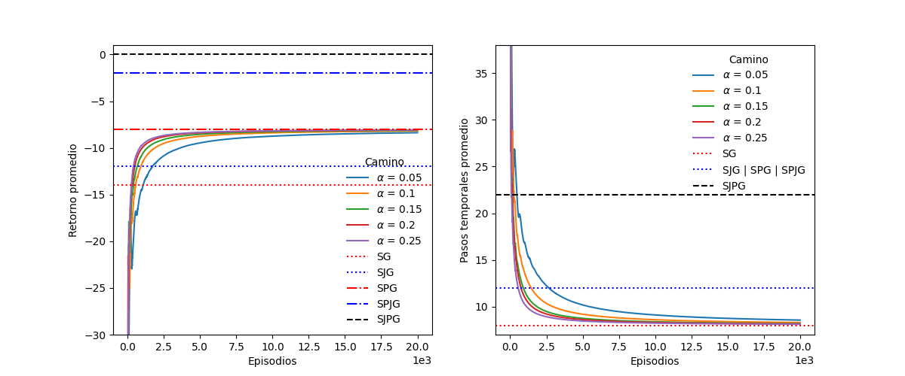

### Barrido de $\gamma$

Parámetros:
* **Variable:** descuento ($\gamma\in[0.35, 1]$).
* **Fijos:** $Eps=2\times10^4$, $\alpha=0.1$ y $\tau=0.05$.

Decisión: fijar $\gamma=0.45$.

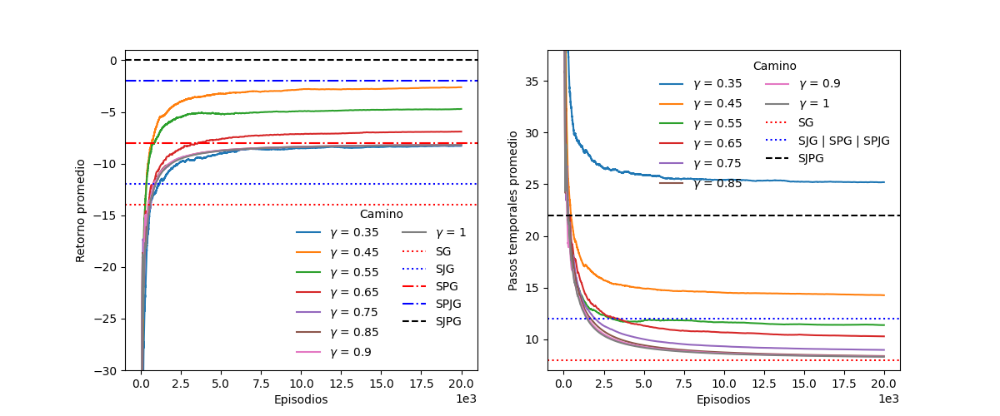

### Barrido de $\tau$

Parámetros:
* **Variable:** temperatura computacional ($\tau\in[0.03, 1]$). Con 0.01 y 0.005 da error: hay probabilidades NaN.
* **Fijos:** $Eps=2\times10^4$, $\alpha=0.1$ y $\gamma=0.45$.

Decisión: fijar $\tau=0.03$.

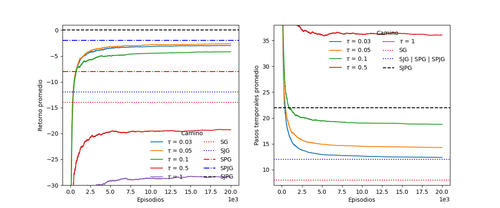

### Cantidad de episodios

Parámetros:
* **Variable:** cantidad de episodios ($Eps\in2\times[10^4, 10^5]$).
* **Fijos:** $\alpha=0.1$, $\gamma=0.45$ y $\tau=0.03$.

Decisión: fijar $Eps=10^5$.

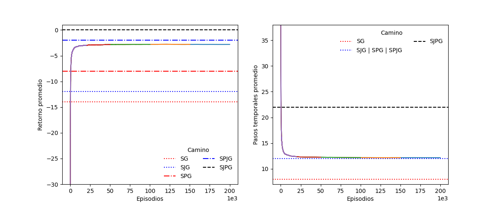

## Q-learning con $\epsilon$-Greedy

### Barrido de $\alpha$

Parámetros:
* **Variable:** tasa de aprendizaje ($\alpha\in[0.05, 0.25]$).
* **Fijos:** $Eps=2\times10^4$, $\gamma=1$ y $\epsilon=0.05$.

Decisión: fijar $\alpha=0.1$.

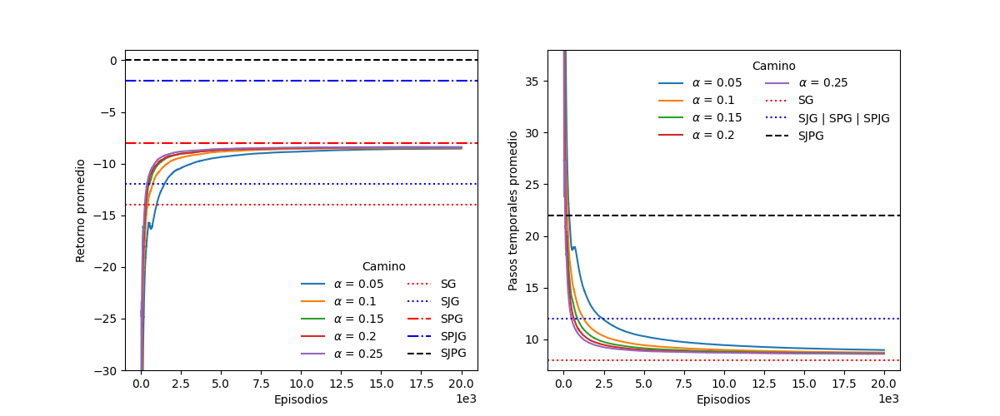

### Barrido de $\gamma$

Parámetros:
* **Variable:** descuento ($\gamma\in[0.35, 1]$).
* **Fijos:** $Eps=2\times10^4$, $\alpha=0.1$ y $\epsilon=0.05$.

Decisión: fijar $\gamma=0.65$.

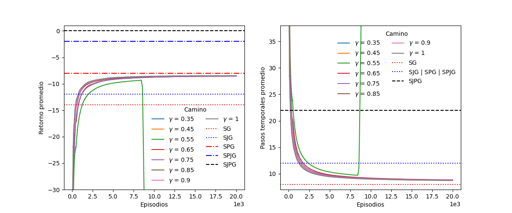

### Barrido de $\epsilon$

Parámetros:
* **Variable:** frecuencia de exploración ($\epsilon\in[0.001, 0.05]$).
* **Fijos:** $Eps=2\times10^4$, $\alpha=0.1$ y $\gamma=0.45$.

Decisión: fijar $\epsilon=0.001$.

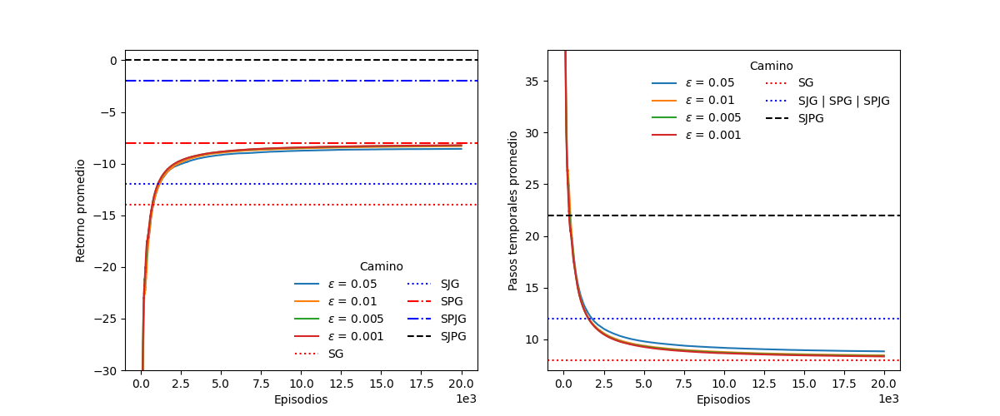

### Cantidad de episodios

Parámetros:
* **Variable:** cantidad de episodios ($Eps\in2\times[10^4, 10^5]$).
* **Fijos:** $\alpha=0.1$, $\gamma=0.65$ y $\epsilon=0.001$.

Decisión: fijar $Eps=10^5$.

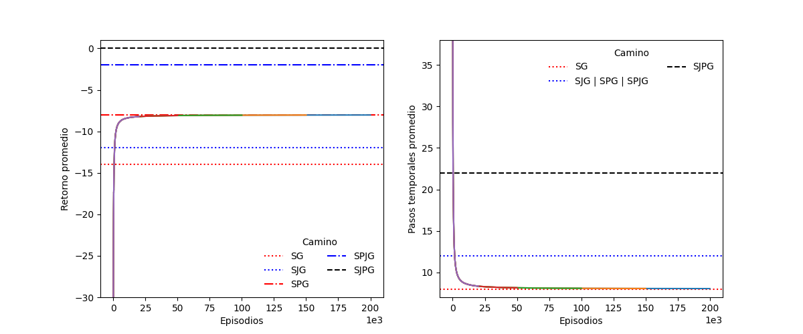

## Dyna-Q

### Barrido de pasos de planificación

Parámetros:
* **Variable:** pasos de planificación ($steps\in[10, 70]$).
* **Fijos:** $Eps=2\times10^4$, $\alpha=0.1$, $\gamma=1$ y $\epsilon=0.05$.

Decisión: fijar $steps=10$.

### Barrido de $\alpha$

Parámetros:
* **Variable:** tasa de aprendizaje ($\alpha\in[0.05, 0.25]$).
* **Fijos:** $Eps=2\times10^4$, $\gamma=1$, $\epsilon=0.05$ y $steps=10$.

Decisión: fijar $\alpha=0.1$.

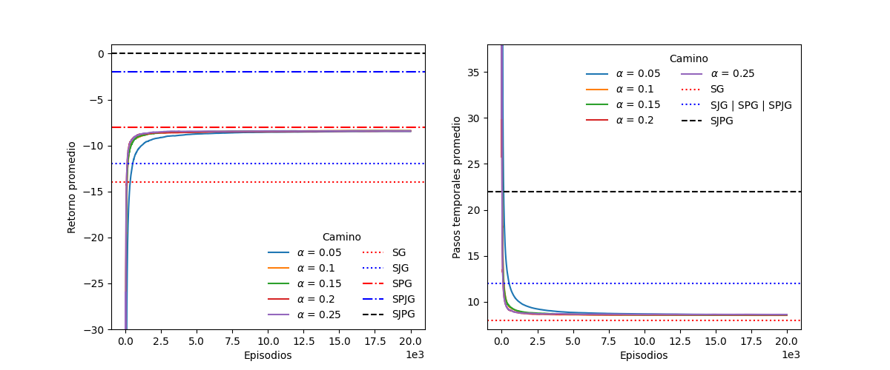

### Barrido de $\gamma$

Parámetros:
* **Variable:** descuento ($\gamma\in[0.75, 1]$). Con 0.55 y 0.65 tarda demasiado.
* **Fijos:** $Eps=2\times10^4$, $\alpha=0.1$, $\epsilon=0.05$ y $steps=10$.

Decisión: fijar $\gamma=0.9$.

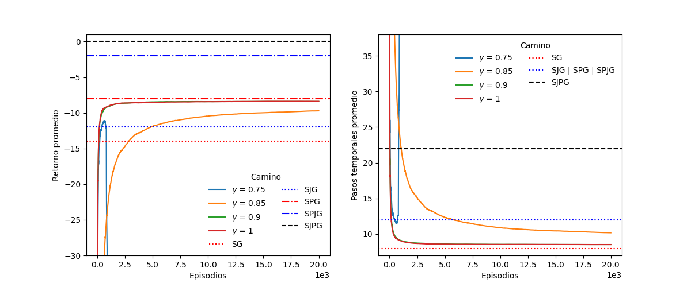

### Barrido de $\epsilon$

Parámetros:
* **Variable:** frecuencia de exploración ($\epsilon\in[0.05, 0.1]$). Con 0.001, 0.005, 0.01 y 0.5 demora demasiado.
* **Fijos:** $Eps=2\times10^4$, $\alpha=0.1$ y $\gamma=0.45$.

Decisión: fijar $\epsilon=0.05$.

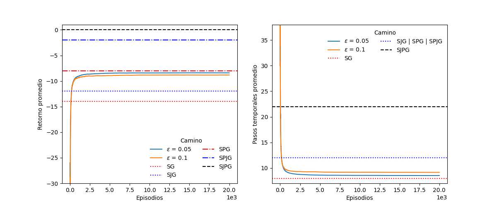

### Cantidad de episodios

Parámetros:
* **Variable:** cantidad de episodios ($Eps\in2\times[10^4, 10^5]$).
* **Fijos:** $\alpha=0.1$, $\gamma=0.9$, $\epsilon=0.05$ y $steps=10$.

Decisión: fijar $Eps=10^5$.

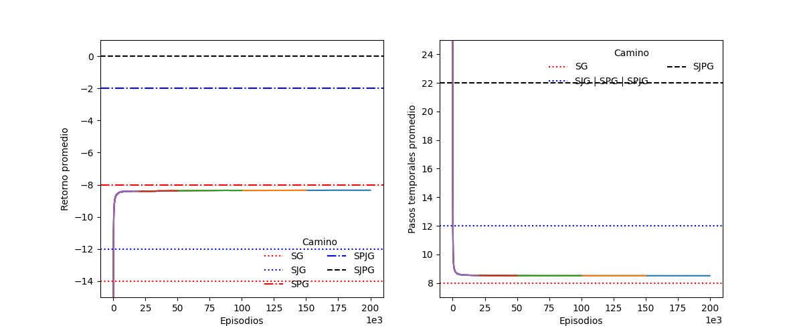

## Comparación final y cierre

Al comparar los mejores resultados de cada algoritmo utilizado, se puede ver que el mejor resulta ser SARSA con SoftMax. Mientras que Dyna-Q y Q-learning con $\epsilon$-greedy tienden a ir por el camino de SPG (buscar el premio extra e ir a la meta), SARSA con SoftMax va un paso más allá y tiende al camino SPJG (buscar el premio extra, luego el jetpack e ir a la meta). Sin embargo, ninguno tiende al camino SJPG, donde busca el jetpack, luego el premio extra y va a la meta.

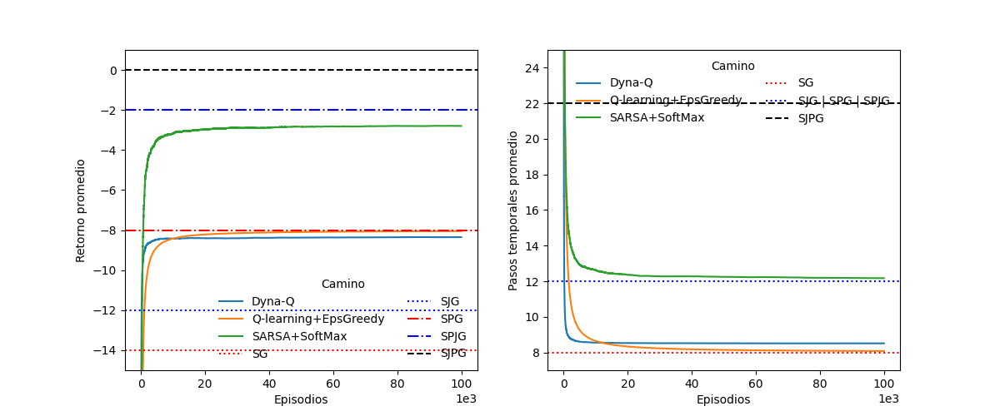