# Diplomatura en ciencia de datos, aprendizaje automático y sus aplicaciones - Edición 2023 - FAMAF (UNC)

## Aprendizaje por refuerzos

### Trabajo práctico entregable 2/2 (materia completa)

**Estudiante:**
- [Chevallier-Boutell, Ignacio José.](https://www.linkedin.com/in/nachocheva/)

**Docentes:**
- Palombarini, Jorge (Mercado Libre).
- Barsce, Juan Cruz (Mercado Libre).

---
# Ejercicio 1 - Cheva's Odyssey

Todos los plots que se utilizan en este ejercicio representan la variación del retorno y la cantidad de pasos temporales en función de cierto parámetro variable, dejando todos los demás fijos.

## SARSA con SoftMax

### Barrido de $\alpha$

Parámetros:
* **Variable:** tasa de aprendizaje ($\alpha\in[0.05, 0.25]$).
* **Fijos:** $Eps=2\times10^4$, $\gamma=1$ y $\tau=0.05$.

Decisión: fijar $\alpha=0.1$.

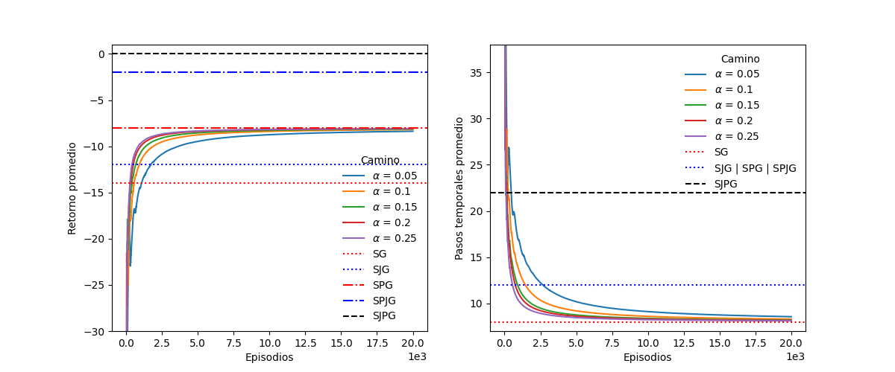

### Barrido de $\gamma$

Parámetros:
* **Variable:** descuento ($\gamma\in[0.35, 1]$).
* **Fijos:** $Eps=2\times10^4$, $\alpha=0.1$ y $\tau=0.05$.

Decisión: fijar $\gamma=0.45$.

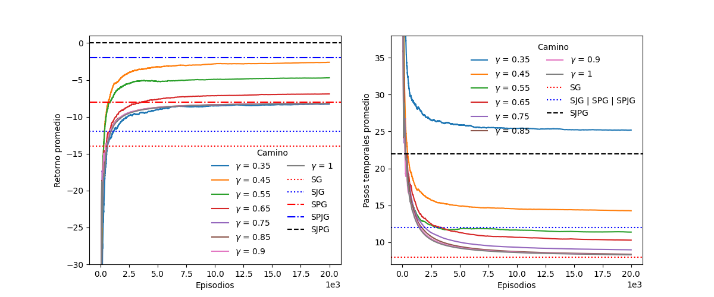

### Barrido de $\tau$

Parámetros:
* **Variable:** temperatura computacional ($\tau\in[0.03, 1]$). Con 0.01 y 0.005 da error: hay probabilidades NaN.
* **Fijos:** $Eps=2\times10^4$, $\alpha=0.1$ y $\gamma=0.45$.

Decisión: fijar $\tau=0.03$.

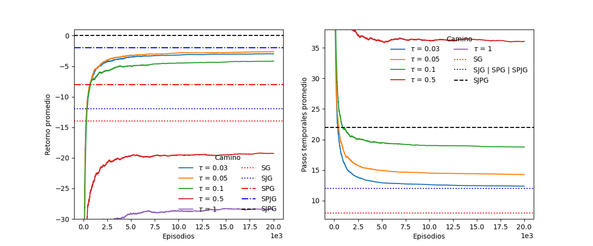

### Cantidad de episodios

Parámetros:
* **Variable:** cantidad de episodios ($Eps\in2\times[10^4, 10^5]$).
* **Fijos:** $\alpha=0.1$, $\gamma=0.45$ y $\tau=0.03$.

Decisión: fijar $Eps=10^5$.

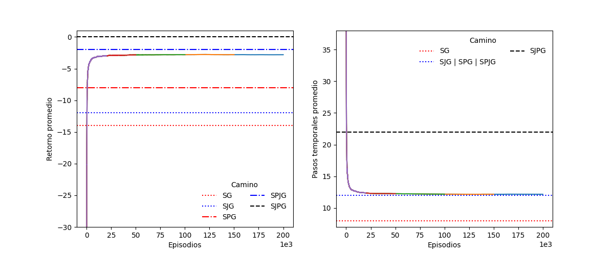

## Q-learning con $\epsilon$-Greedy

### Barrido de $\alpha$

Parámetros:
* **Variable:** tasa de aprendizaje ($\alpha\in[0.05, 0.25]$).
* **Fijos:** $Eps=2\times10^4$, $\gamma=1$ y $\epsilon=0.05$.

Decisión: fijar $\alpha=0.1$.

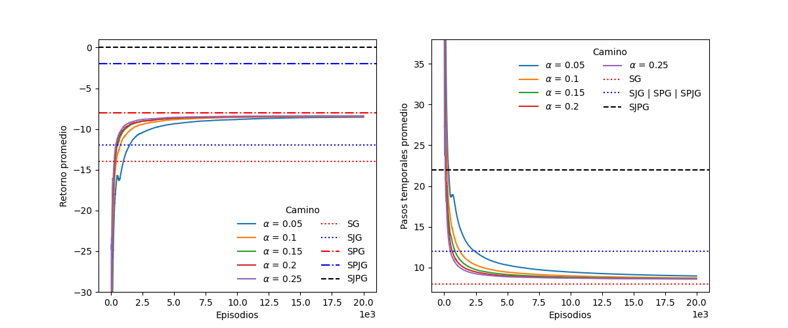

### Barrido de $\gamma$

Parámetros:
* **Variable:** descuento ($\gamma\in[0.35, 1]$).
* **Fijos:** $Eps=2\times10^4$, $\alpha=0.1$ y $\epsilon=0.05$.

Decisión: fijar $\gamma=0.65$.

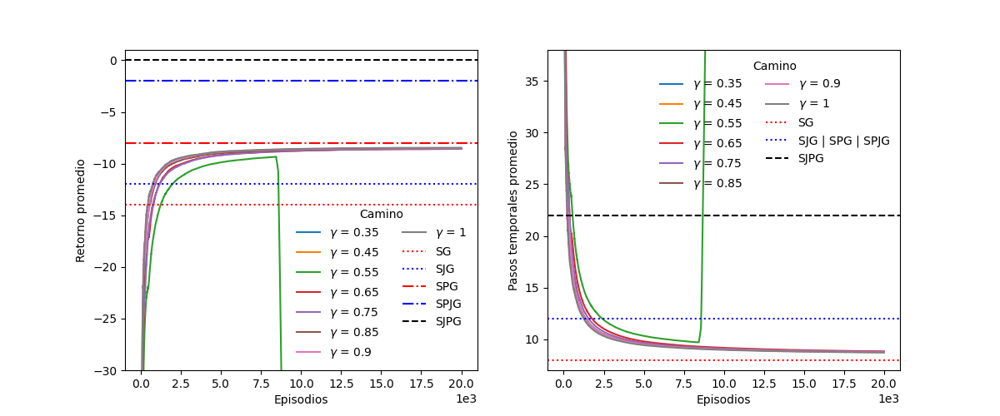

### Barrido de $\epsilon$

Parámetros:
* **Variable:** frecuencia de exploración ($\epsilon\in[0.001, 0.05]$).
* **Fijos:** $Eps=2\times10^4$, $\alpha=0.1$ y $\gamma=0.45$.

Decisión: fijar $\epsilon=0.001$.

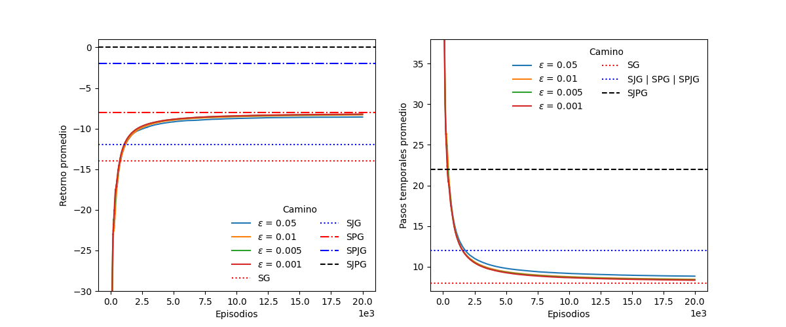

### Cantidad de episodios

Parámetros:
* **Variable:** cantidad de episodios ($Eps\in2\times[10^4, 10^5]$).
* **Fijos:** $\alpha=0.1$, $\gamma=0.65$ y $\epsilon=0.001$.

Decisión: fijar $Eps=10^5$.

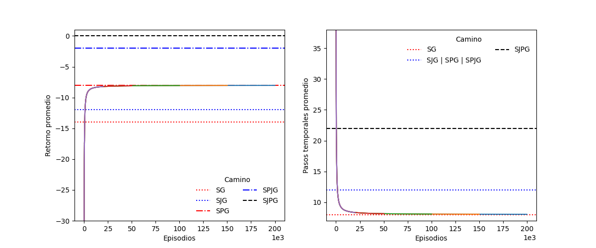

## Dyna-Q

### Barrido de pasos de planificación

Parámetros:
* **Variable:** pasos de planificación ($steps\in[10, 70]$).
* **Fijos:** $Eps=2\times10^4$, $\alpha=0.1$, $\gamma=1$ y $\epsilon=0.05$.

Decisión: fijar $steps=10$.

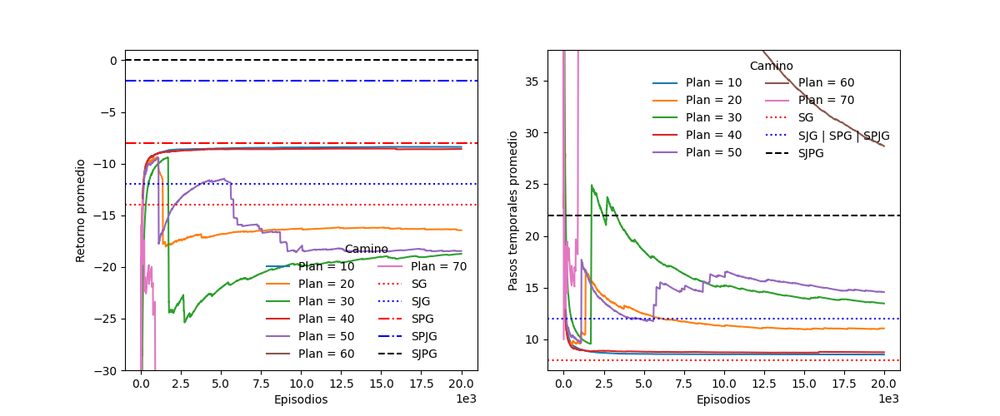

### Barrido de $\alpha$

Parámetros:
* **Variable:** tasa de aprendizaje ($\alpha\in[0.05, 0.25]$).
* **Fijos:** $Eps=2\times10^4$, $\gamma=1$, $\epsilon=0.05$ y $steps=10$.

Decisión: fijar $\alpha=0.1$.

### Barrido de $\gamma$

Parámetros:
* **Variable:** descuento ($\gamma\in[0.75, 1]$). Con 0.55 y 0.65 tarda demasiado.
* **Fijos:** $Eps=2\times10^4$, $\alpha=0.1$, $\epsilon=0.05$ y $steps=10$.

Decisión: fijar $\gamma=0.9$.

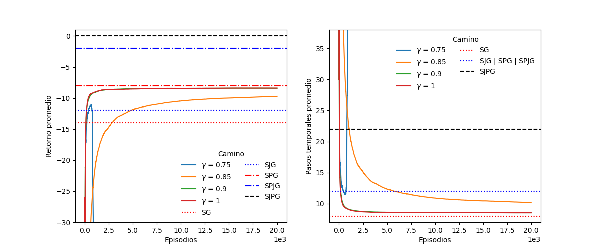

### Barrido de $\epsilon$

Parámetros:
* **Variable:** frecuencia de exploración ($\epsilon\in[0.05, 0.1]$). Con 0.001, 0.005, 0.01 y 0.5 demora demasiado.
* **Fijos:** $Eps=2\times10^4$, $\alpha=0.1$ y $\gamma=0.45$.

Decisión: fijar $\epsilon=0.05$.

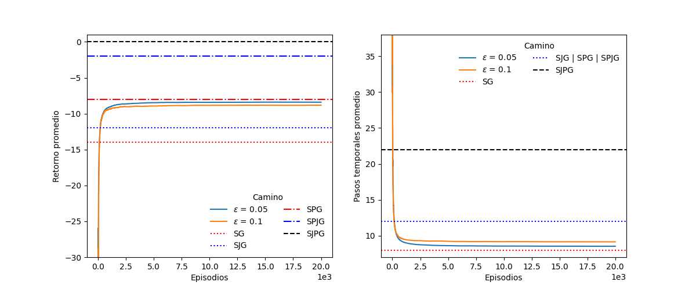

### Cantidad de episodios

Parámetros:
* **Variable:** cantidad de episodios ($Eps\in2\times[10^4, 10^5]$).
* **Fijos:** $\alpha=0.1$, $\gamma=0.9$, $\epsilon=0.05$ y $steps=10$.

Decisión: fijar $Eps=10^5$.

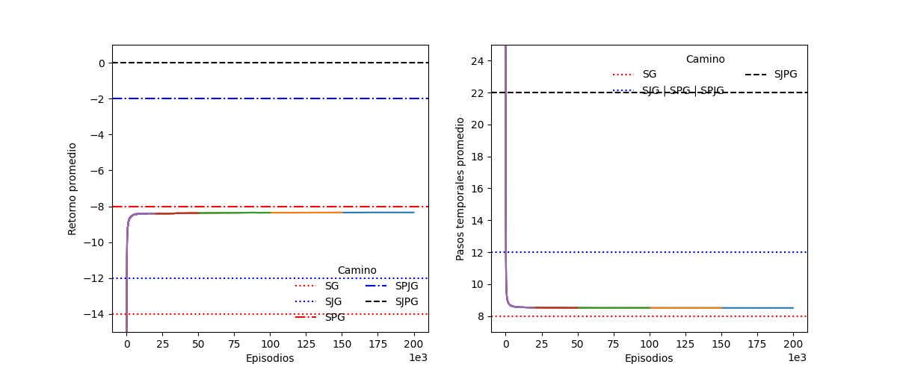

## Comparación final y cierre

Al comparar los mejores resultados de cada algoritmo utilizado, se puede ver que el mejor resulta ser SARSA con SoftMax. Mientras que Dyna-Q y Q-learning con $\epsilon$-greedy tienden a ir por el camino de SPG (buscar el premio extra e ir a la meta), SARSA con SoftMax va un paso más allá y tiende al camino SPJG (buscar el premio extra, luego el jetpack e ir a la meta). Sin embargo, ninguno tiende al camino SJPG, donde busca el jetpack, luego el premio extra y va a la meta.

---
# Ejercicio 2 - Lunar Lander

Todos los plots que se utilizan en este ejercicio representan la recompensa promedio por episodio (izquierda) y la función de costo (derecha), en función de la cantidad de pasos, para cierto parámetro variable, dejando todos los demás fijos.

## DQN

### Barrido de $\epsilon$

Parámetros:
* **Variable:** etapa de exploracón ($\epsilon\in[0.1, 0.9]$). Se estudiaron 9 casos, se muestran los 3 mejores: 0.1, 0.3 y 0.5 siendo gris, rosa y violeta, respectivamente.
* **Fijos:** $\alpha=0.0001$, $\gamma=0.99$ y $steps=6\times10^5$.

Decisión: fijar $\epsilon=0.3$. Observamos que en ningún caso se alcanza los 200 puntos de recompensa todavía.

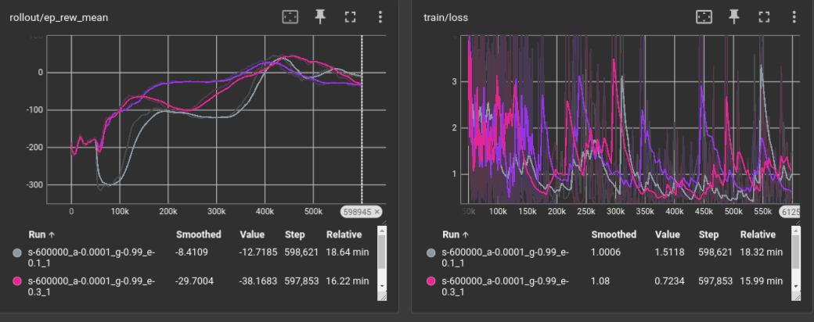

### Barrido de $\alpha$

Parámetros:
* **Variable:** tasa de aprendizaje ($\alpha\in[10^{-1}, 10^{-6}]$). Se estudiaron 6 casos, se muestran los 3 mejores: $10^{-4}$, $10^{-3}$ y $10^{-2}$ siendo violeta, verde y celeste, respectivamente.
* **Fijos:** $\epsilon=0.3$, $\gamma=0.99$ y $steps=6\times10^5$.

Decisión: fijar $\alpha=10^{-3}$. Observamos que este es el primer caso que alcanza los 200 puntos.

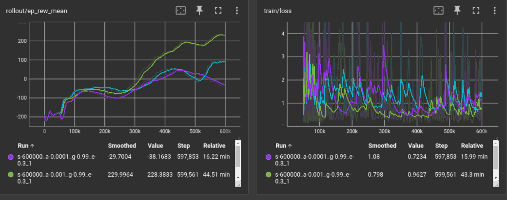

### Barrido de $\gamma$

Parámetros:
* **Variable:** factor de descuento ($\gamma\in[0.85, 0.99999]$). Se estudiaron 6 casos, se muestran los 3 mejores: 0.99, 0.999, 0.99999 siendo gris, rosa y verde, respectivamente.
* **Fijos:** $\epsilon=0.3$, $\alpha=10^{-3}$ y $steps=6\times10^5$.

Decisión: fijar $\gamma=0.99$. Observamos que todos los casos alcanzan los 200 puntos.

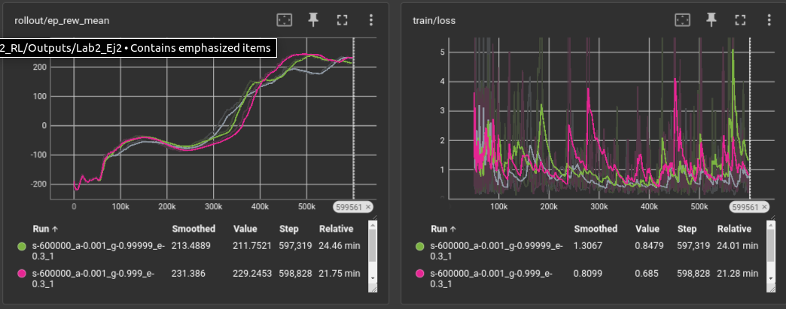

### Barrido de cantidad de pasos

Parámetros:
* **Variable:** cantidad de pasos ($steps\in[5\times10^4, 4\times10^6]$). Se estudiaron 7 casos, se muestran los 3 mejores: 0.99, 0.999, 0.99999 siendo gris, rosa y verde, respectivamente.
* **Fijos:** $\epsilon=0.3$, $\alpha=10^{-3}$ y $steps=6\times10^5$.

Decisión: fijar $steps=2\times10^6$. Observamos que convendría tomar los resultados alrededor del paso $1.66\times10^6$ aproximadamente.

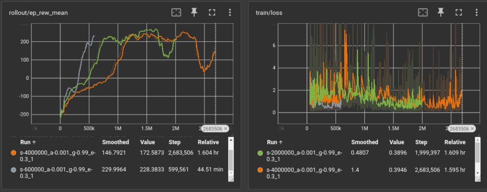

## PPO

### Barrido de épocas

Parámetros:
* **Variable:** épocas ($epoch\in[10, 150]$). Se estudiaron 6 casos, se muestran los 3 mejores: 50, 75 y 150 siendo violeta, naranja y gris, respectivamente.
* **Fijos:** $\alpha=0.0003$, $\gamma=0.99$ y $steps=\times10^5$.

Decisión: fijar $epoch=50$.

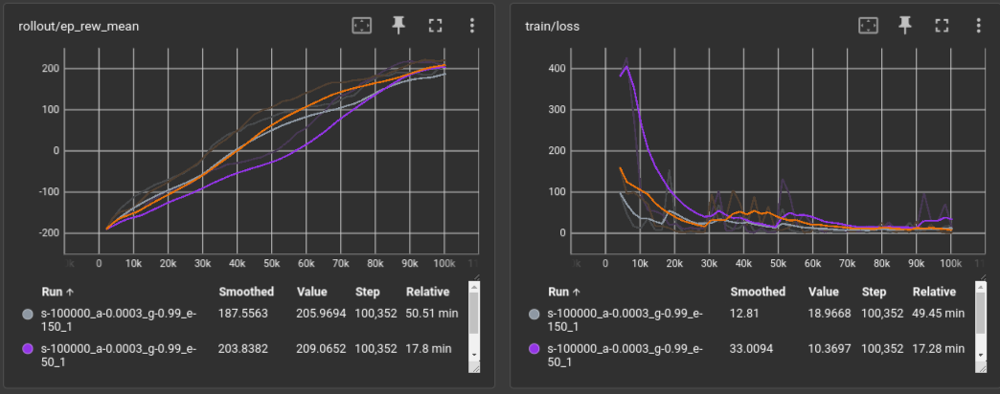

### Barrido de $\alpha$

Parámetros:
* **Variable:** tasa de aprendizaje ($\alpha\in[10^{-2}, 10^{-6}]$). Se estudiaron 5 casos, se muestran los 3 mejores: $10^{-4}$, $10^{-3}$ y $3\times10^{-3}$ siendo amarillo, celeste y gris, respectivamente.
* **Fijos:** $epoch=50$, $\gamma=0.99$ y $steps=1\times10^5$.

Decisión: fijar $\alpha=3\times10^{-3}$. Observamos que este es el único caso que alcanza los 200 puntos.

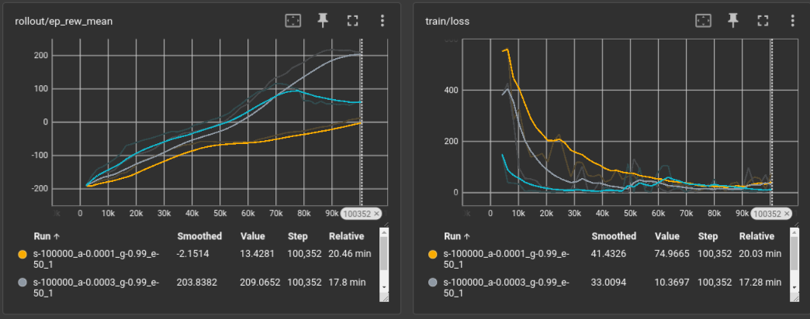

### Barrido de $\gamma$

Parámetros:
* **Variable:** factor de descuento ($\gamma\in[0.9, 0.9999]$). Se estudiaron 4 casos: 0.9, 0.99, 0.999 y 0.9999 siendo celeste, gris, rosa y amarillo, respectivamente.
* **Fijos:** $epoch=50$, $\alpha=3\times10^{-3}$ y $steps=1\times10^5$.

Decisión: fijar $\gamma=0.99$.

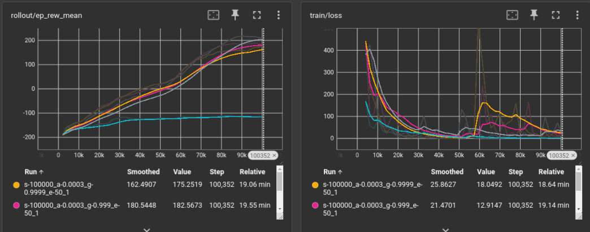

## DQN vs PPO

Se comparan ambos algoritmos con sus parámetros óptimos, teniendo $steps=2\times10^6$. Si bien PPO alcanza los 200 puntos muchos antes que DQN, cerca de los 120 mil pasos, demora unos 22 minutos en llegar a este valor, mientras que DQN alcanza un valor semejante en unos 35 minutos a los 800 mil pasos. El máximo puntaje alcanzado por PPO es de 252 a los 540 mil pasos, luego de 1 h 50 min, mientras que el máximo puntaje alcanzado por DQN es de 270 a los 166 mil pasos, luego de 1 h 30 min. Además, DQN presenta un coste muchísimo menor a lo largo de todas las iteraciones. Se considera entonces que es mejor utilizar DQN para resolver el problema en cuestión.

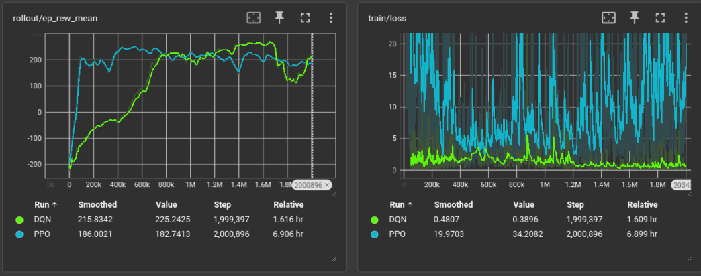